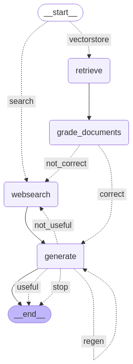

# 🔍🤖 Advanced RAG

An advanced RAG, it takes inspiration from several papers:
* [Adaptive-RAG](https://arxiv.org/abs/2403.14403)
* [Corrective-RAG](https://arxiv.org/abs/2401.15884)
* [Self-RAG](https://arxiv.org/abs/2310.11511)

The adaptive component is based on using a logical routing, where the agent decides wether to perform retrieval or direcly getting external knowledge from the web via Tavily.
Where the self-correction is aimed at assessing wether the retrieved documents are aligned with the posed question.
Each document is evaluated by a document grader agent, if at least 50% of the documents are aligned with the question, it is considered aligned and goes to the self-reflection part using only the relevant documents. Otherwise, it calls Tavily to get more external context/information, thus appending to the relevant documents the ones retrieved from the web.
The self-reflection is aimed at assessing first if the retrieved documents are aligned with the answer given in the generation node, if not it regenerates the answer, otherwise it goes to the second self-reflection. The second self-reflection is aimed at assessing wether the answer is aligned with the question, if not it calls Tavily to get more external context/information.
The retrieval uses Pinecone as vector store with semantic search and reranking using HuggingFace reranker.
The generation is done by performing contextual compression before passing the retrieved documents to the LLM.
The chunking is done via Semantic chunking.

The graph is the following:



## ✨ Features

- **State-of-the-Art implementation**: Takes ideas from three different papers and combines in a unique way
- **Software Engineering**: Built with best practices in mind, ensuring maintainability, testing and modularity
- **Dual Search Capabilities**: Leverage both Tavily's AI-powered (and Google Serper) search and Wikipedia's vast knowledge base
- **Retrieval with reranking**: Combines and summarizes information from multiple sources
- **Generation with contextual compression**: Ensures the given context is concise and relevant
- **Interactive UI**: Built with Streamlit for a seamless user experience
- **Context-Aware Responses**: Maintains conversation history for more relevant follow-ups
- **Full logging**: Keeps a record of all interactions for debugging and analysis
- **Full tracing**: Logs every interaction, including the user's query, the agent's response, and the sources used via [LangSmith](https://www.smith.langchain.com)
- **Easy Settingup**: Use [uv](https://docs.astral.sh/uv/) to  set up the project environment

## 🚀 Quick Start

1. Clone the repository:
```bash
git clone https://github.com/AlfredoCinelli/advanced-rag.git
cd repo_name
```

2. Install dependencies ([install uv first](https://docs.astral.sh/uv/getting-started/installation/)):
```bash
uv sync
```

3. Set up your environment variables (in the `local/.env` file), see below for more details.

4. Run the application (via Make):
```bash
make app
```
Unit-tests (via Make):
```bash
make pytest
```

## 📝 Configuration

Configure the agent through `local/.env` file:

```yaml
TAVILY_API_KEY="your_tavily_api_key"
SERPER_API_KEY="your_serpapi_api_key"
LANGCHAIN_TRACING_V2=true
LANGCHAIN_ENDPOINT="https://api.smith.langchain.com"
LANGCHAIN_API_KEY="your_langchain_api_key"
LANGCHAIN_PROJECT="your_project_name"
```

## 🤝 Contributing

We welcome contributions! Please follow these steps:

1. Fork the repository
2. Create a feature branch (`git checkout -b feature/AmazingFeature`)
3. Commit your changes (`git commit -m 'Add AmazingFeature'`)
4. Push to the branch (`git push origin feature/AmazingFeature`)
5. Open a Pull Request

## 📄 License

This project is licensed under the MIT License - see the [LICENSE](LICENSE) file for details.

## 🙏 Acknowledgments

- [Tavily API](https://tavily.com) for powerful search capabilities
- [Wikipedia API](https://pypi.org/project/wikipedia/) for knowledge base access
- [Streamlit](https://streamlit.io) for the amazing UI framework

## 📞 Support

- 📧 Email: alfredocinelli@gmail.com
- 🐛 Issues: [GitHub Issues](https://github.com/AlfredoCinelli/)

---


Made with ❤️ by [Alfredo Cinelli](https://github.com/alfredocinelli)